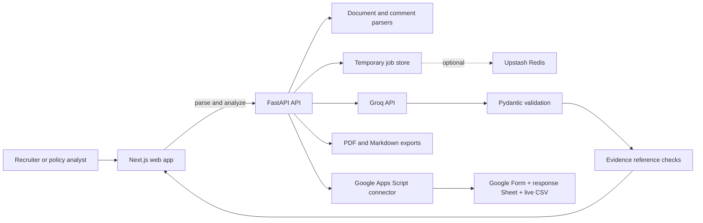
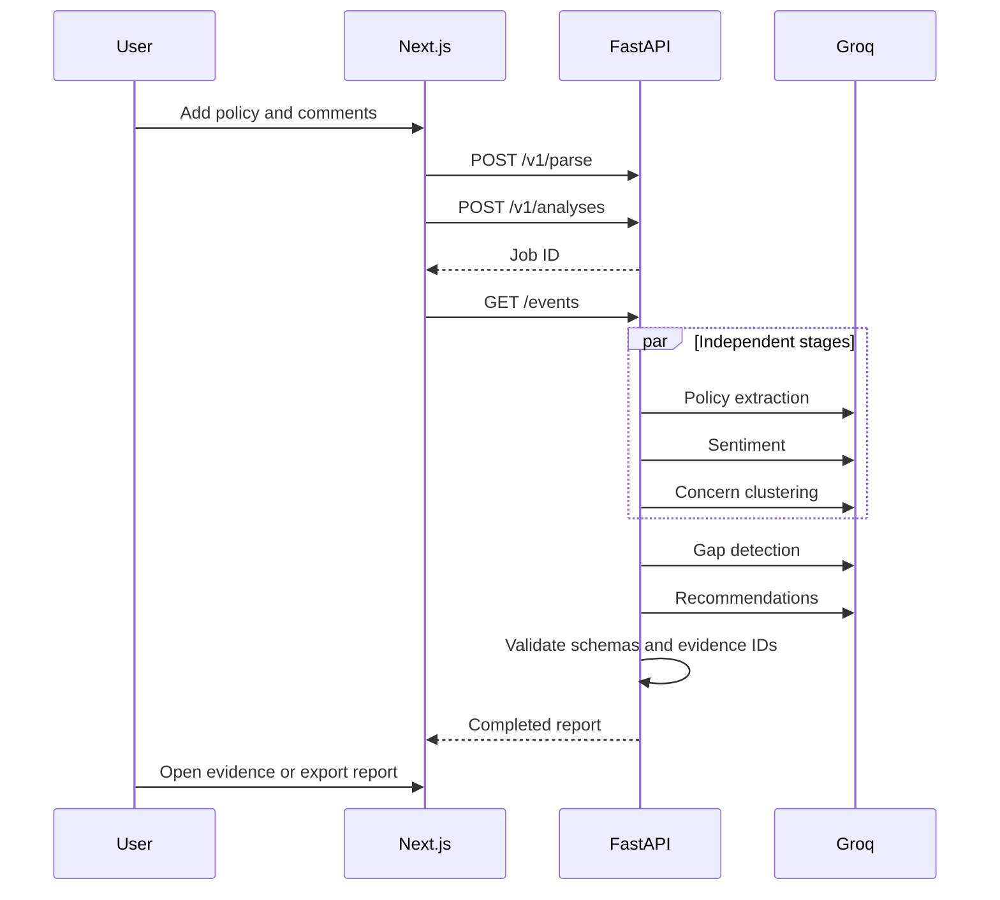

# PolicyPulse AI

PolicyPulse AI turns proposed policies and stakeholder comments into traceable
concerns, policy gaps, prioritized recommendations, and a decision-ready report.

The production MVP is a focused Next.js + FastAPI application. The original
Streamlit hackathon application remains at [`app.py`](./app.py) for comparison.

> Public feedback is often collected but not properly understood. PolicyPulse
> connects every major finding back to the exact policy passage or public
> comment that supports it.

## Product highlights

- PDF, DOCX, TXT, CSV, and pasted-text inputs.
- Google Forms CSV/XLSX response exports and multi-column open responses.
- Eight-stage hybrid AI workflow with live progress.
- Selectable production orchestration: explicit Python baseline or LangGraph.
- Comment-level coding with deterministic sentiment and frequency calculations.
- Strict Pydantic schemas and malformed-output retry.
- Clickable evidence for concerns, gaps, and recommendations.
- Accessible concern chart with a tabular fallback.
- Branded PDF and Markdown reports.
- Cached sample analysis when live AI is unavailable.
- Policy-only survey generation for consultations that do not have feedback yet.
- Optional Google Forms creation with linked Sheets, live Drive CSV, and Excel export.
- Light and dark themes with responsive, keyboard-accessible UI.
- Temporary job storage, rate limits, request IDs, health checks, and CI.

## Screenshots and live demo

- Live app: _add the Vercel URL after deployment_
- API documentation: _add the Render `/docs` URL after deployment_
- Demo video: _record using [`docs/DEMO_VIDEO_SCRIPT.md`](./docs/DEMO_VIDEO_SCRIPT.md)_
- Orchestration evaluation: [`docs/ORCHESTRATION_EVALUATION.md`](./docs/ORCHESTRATION_EVALUATION.md)
- Screenshots: _add final deployment screenshots after URLs are available_

## Architecture





## Repository layout

```text
apps/
  api/    FastAPI service, AI orchestration, schemas, reports, tests
  web/    Next.js application, design system, results and evidence UI
app.py    preserved Streamlit hackathon version
design-system/MASTER.md
sample_data/
```

## Local setup

Requirements:

- Python 3.11+
- Node.js 22+
- A Groq or xAI Grok API key for live analysis

```powershell
git clone <repository-url>
cd policypulse-ai
Copy-Item .env.example .env
```

Add your key to `.env`:

```env
GROQ_API_KEY=your_key_here
# Or use XAI_API_KEY=your_key_here
NEXT_PUBLIC_API_URL=http://127.0.0.1:8000
```

Install and run the API:

```powershell
python -m venv .venv
.\.venv\Scripts\Activate.ps1
pip install -e ".\apps\api[dev]"
uvicorn policypulse_api.main:app --app-dir apps/api --reload --port 8000
```

Install and run the web application in another terminal:

```powershell
cd apps\web
npm install
npm run dev
```

Open [http://localhost:3000](http://localhost:3000). API documentation is at
[http://localhost:8000/docs](http://localhost:8000/docs).

Docker is also supported:

```powershell
docker compose up --build
```

## Configuration

| Variable | Required | Purpose |
| --- | --- | --- |
| `GROQ_API_KEY` | Live AI only | Server-side model access; never sent to the browser |
| `GROQ_MODEL` | No | Defaults to `llama-3.3-70b-versatile` |
| `XAI_API_KEY` | Live AI only | Optional xAI Grok API key for the same analysis pipeline |
| `XAI_MODEL` | No | Defaults to `grok-4.3` |
| `LLM_PROVIDER` | No | Optional explicit provider override: `groq` or `xai` |
| `ANALYSIS_ORCHESTRATOR` | No | `python` by default; set `langgraph` to run the same production workflow through LangGraph |
| `FRONTEND_ORIGIN` | Production | Allowed web origin for CORS |
| `NEXT_PUBLIC_API_URL` | Yes | Browser-visible FastAPI base URL |
| `UPSTASH_REDIS_REST_URL` | No | Optional temporary distributed job storage |
| `UPSTASH_REDIS_REST_TOKEN` | No | Optional Upstash credential |
| `GOOGLE_SCRIPT_URL` | Google Forms only | Deployed Apps Script Web App URL |
| `GOOGLE_SCRIPT_SECRET` | Google Forms only | Shared connector secret |

Without Upstash, the API uses an in-memory TTL store suitable for a single free
Render instance and portfolio demonstration.

### Google Forms setup

The connector source and exact deployment instructions are in
[`integrations/google-apps-script`](./integrations/google-apps-script). It runs
under the project owner's Google account. Each generated form is linked to a
Google Sheet, and an installable trigger refreshes a CSV file in Drive after
every response. The owner also receives direct CSV and Excel export links.

## Testing

Backend:

```powershell
python -m pytest apps\api\tests -q
python -m ruff check apps\api
python -m mypy --config-file apps\api\pyproject.toml apps\api\policypulse_api
```

Optional orchestration work:

```powershell
pip install -e ".\apps\api[langgraph,experiments]"
$env:ANALYSIS_ORCHESTRATOR="langgraph"
.\.venv\Scripts\python.exe experiments\benchmark_orchestrators.py
.\.venv\Scripts\python.exe experiments\crewai_small_workflow.py
```

Frontend:

```powershell
cd apps\web
npm run lint
npm run typecheck
npm run build
npx playwright install chromium
npm run test:e2e
```

GitHub Actions repeats backend, frontend, end-to-end, dependency, and secret
checks on pushes and pull requests.

## Deployment

### API on Render

Use [`apps/api/render.yaml`](./apps/api/render.yaml), then configure:

- `GROQ_API_KEY`
- `FRONTEND_ORIGIN` with the final Vercel URL
- optional Upstash values

### Web on Vercel

Import the repository, select `apps/web` as the root directory, and configure:

```env
NEXT_PUBLIC_API_URL=https://your-render-service.onrender.com
```

Free-tier behavior and limits can change; verify current provider terms before
deployment.

## Privacy and responsible AI

- Uploaded content is processed for the current analysis and is not permanently
  stored by the application.
- Temporary jobs expire automatically.
- Content is sent to the configured AI provider.
- Every generated finding must reference valid indexed evidence or be labeled
  as limited evidence.
- Outputs are AI-generated, require human review, and are not legal advice.
- Do not upload confidential or personally identifying data to the public demo.

## Engineering trade-offs

This MVP intentionally avoids authentication, billing, permanent databases,
microservices, Kubernetes, and heavy agent frameworks. Those additions would
increase operational surface without improving the core portfolio story:

**clean UX + real AI workflow + traceable evidence + report export + reliable
engineering.**

The stable baseline still uses explicit Python services and typed schemas so its
behavior is easy to inspect, test, and explain in an interview. LangGraph is
available as the main advanced orchestration option, while any other framework
comparison stays isolated under [`experiments/`](./experiments).

For model providers, the production pipeline supports both Groq and xAI Grok.
If both keys are present, set `LLM_PROVIDER` explicitly so demos stay predictable.

## Legacy hackathon app

The original Streamlit version remains runnable:

```powershell
.\.venv\Scripts\python.exe -m streamlit run app.py
```

It is preserved to show the project’s evolution from hackathon prototype to
production-oriented portfolio MVP.
