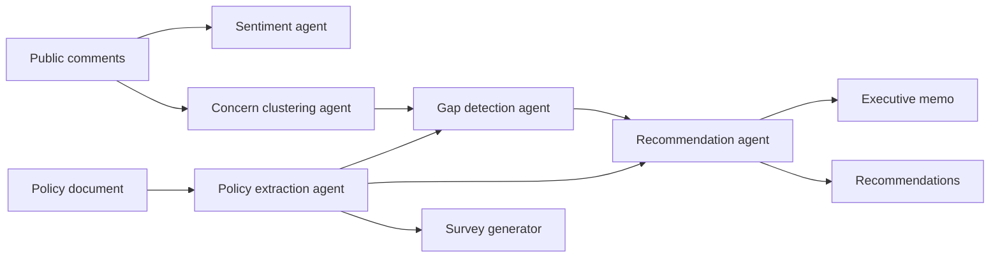

<div align="center">

# PolicyPulse AI

Policy review gets messy fast when feedback lives in PDFs, spreadsheets, and long comment threads. PolicyPulse AI turns that sprawl into a clear summary, visible concerns, policy gaps, and practical next steps.

[](#technology-stack)
[](#technology-stack)
[](#legacy-streamlit-reference)
[](#configuration)
[](#what-the-project-does)

<p>
  <a href="https://policypulse-ai-hszxdykcrmm678rtam6wjc.streamlit.app/">
    
  </a>
  <a href="https://github.com/zain333ux/policypulse-ai">
    
  </a>
</p>

<p>
  <a href="#live-project">Live project</a> •
  <a href="#what-the-project-does">What it does</a> •
  <a href="#how-it-works">How it works</a> •
  <a href="#technology-stack">Tech stack</a> •
  <a href="#local-setup">Local setup</a>
</p>

</div>

---

## Live project

<table>
  <tr>
    <td><strong>Live app</strong></td>
    <td><a href="https://policypulse-ai-hszxdykcrmm678rtam6wjc.streamlit.app/">policypulse-ai-hszxdykcrmm678rtam6wjc.streamlit.app</a></td>
  </tr>
  <tr>
    <td><strong>Repository</strong></td>
    <td><a href="https://github.com/zain333ux/policypulse-ai">github.com/zain333ux/policypulse-ai</a></td>
  </tr>
  <tr>
    <td><strong>Frontend</strong></td>
    <td>Deployed on Vercel</td>
  </tr>
  <tr>
    <td><strong>Backend</strong></td>
    <td>Deployed on Render, with Streamlit used as the public demo experience</td>
  </tr>
</table>

## What the project does

PolicyPulse AI helps teams review proposed policies with actual evidence behind the conclusions. A user uploads a draft policy and a set of public or student comments. The system then turns that material into a structured report that is easier to read, easier to explain, and easier to act on.

The current production application uses a Next.js frontend with a FastAPI backend. The original Streamlit implementation is still available in `app.py` as the hackathon reference version.

### Core outputs

- Policy summary and extracted rules
- Support, opposition, and neutral sentiment analysis
- Concern clusters built from repeated feedback themes
- Policy gaps linked to what people are actually worried about
- Prioritized recommendations
- Executive memo for quick decision-making
- Survey blueprint for cases where feedback has not been collected yet

## Why this project matters

Public feedback is often collected, then buried in long documents and scattered responses. That makes it hard for student bodies, civic teams, and policy reviewers to see what really matters.

PolicyPulse AI gives them a faster way to move from raw text to something useful: a readable summary, traceable evidence, and a clearer next step.

### What makes it useful

- Faster review of long policy drafts and messy feedback sets
- Clearer decisions backed by traceable evidence
- Better communication for leadership, committees, and civic teams
- A built-in path to generate a survey when feedback has not been collected yet

## Product snapshot

| Stage | What happens |
| --- | --- |
| Input | Upload a policy and public comments from PDF, DOCX, TXT, CSV, pasted text, or spreadsheet exports |
| Analysis | Run a structured multi-agent workflow that extracts rules, reads sentiment, clusters concerns, detects gaps, and generates recommendations |
| Output | Review evidence-backed results in the UI, export reports, and generate a survey blueprint if more feedback is needed |

## How it works



### Agentic workflow

The production system is intentionally not a framework zoo. It uses a stable baseline with one main advanced orchestration path, plus one isolated comparison experiment.

| Layer | Role | Status |
| --- | --- | --- |
| Explicit Python workflow | Stable production baseline | Active |
| LangGraph | Main advanced orchestration implementation | Active |
| CrewAI | Small isolated comparison experiment | Experimental |

The production application does not mix LangGraph, CrewAI, AutoGen, and ADK inside the same runtime path.

## Technology stack

### Application

- Next.js
- React
- TypeScript
- FastAPI
- Python

### AI and orchestration

- Groq API as the default live LLM provider
- Optional xAI Grok support
- Explicit Python orchestration
- LangGraph as the main advanced orchestration path
- CrewAI as an isolated comparison experiment

### Data and parsing

- pandas
- PyMuPDF
- python-docx

### Visualization and UX

- Plotly
- Streamlit

## Deployment

### Frontend

- Platform: Vercel
- Root directory: `apps/web`
- Main browser variable: `NEXT_PUBLIC_API_URL`

### Backend

- Platform: Render
- Root directory: `apps/api`
- Build command: `pip install .`
- Start command: `uvicorn policypulse_api.main:app --host 0.0.0.0 --port $PORT`

Current blueprint:

- [`render.yaml`](./render.yaml)

## Repository layout

```text
apps/
  api/    FastAPI service, orchestration, schemas, reports, tests
  web/    Next.js application, analysis UI, survey UI, and evidence views
app.py    preserved Streamlit reference implementation
docs/     architecture notes, product documentation, and internal planning
experiments/
sample_data/
```

## Local setup

### Requirements

- Python 3.11+
- Node.js 22+
- A Groq API key for live analysis

### Clone and prepare the environment

```powershell
git clone <repository-url>
cd policypulse-ai
Copy-Item .env.example .env
```

Add the core variables to `.env`:

```env
GROQ_API_KEY=your_key_here
NEXT_PUBLIC_API_URL=http://127.0.0.1:8000
```

Optional provider settings:

```env
LLM_PROVIDER=groq
XAI_API_KEY=your_xai_key_here
XAI_MODEL=grok-4.3
```

### Run the API

```powershell
python -m venv .venv
.\.venv\Scripts\Activate.ps1
pip install -e ".\apps\api[dev]"
uvicorn policypulse_api.main:app --app-dir apps/api --reload --port 8000
```

### Run the web application

Open another terminal:

```powershell
cd apps\web
npm install
npm run dev
```

Then open [http://localhost:3000](http://localhost:3000).

API documentation is available at [http://localhost:8000/docs](http://localhost:8000/docs).

### Docker

```powershell
docker compose up --build
```

## Configuration

| Variable | Required | Purpose |
| --- | --- | --- |
| `GROQ_API_KEY` | Live AI only | Server-side model access |
| `GROQ_MODEL` | No | Defaults to `llama-3.3-70b-versatile` |
| `XAI_API_KEY` | Live AI only | Optional xAI Grok API key |
| `XAI_MODEL` | No | Defaults to `grok-4.3` |
| `LLM_PROVIDER` | No | Explicit provider override: `groq` or `xai` |
| `ANALYSIS_ORCHESTRATOR` | No | `python` by default; set `langgraph` for the advanced orchestration path |
| `FRONTEND_ORIGIN` | Production | Allowed web origin for CORS |
| `NEXT_PUBLIC_API_URL` | Yes | Browser-visible FastAPI base URL |
| `UPSTASH_REDIS_REST_URL` | No | Optional temporary distributed job storage |
| `UPSTASH_REDIS_REST_TOKEN` | No | Optional Upstash credential |
| `GOOGLE_SCRIPT_URL` | Google Forms only | Deployed Apps Script Web App URL |
| `GOOGLE_SCRIPT_SECRET` | Google Forms only | Shared connector secret |

Without Upstash, the API uses an in-memory TTL store, which is appropriate for a single free Render instance.

## Google Forms setup

The connector source and deployment instructions are in [`integrations/google-apps-script`](./integrations/google-apps-script).

Each generated form is linked to a Google Sheet. An installable trigger refreshes a CSV file in Drive after every response. The owner also receives direct CSV and Excel export links.

### Current capability

| Feature | Current status |
| --- | --- |
| Generate survey blueprint from a policy | Supported |
| Deploy survey to Google Forms | Supported when `GOOGLE_SCRIPT_URL` and `GOOGLE_SCRIPT_SECRET` are configured |
| Import Google Form responses back into the app | Supported when the Apps Script bridge is deployed |
| Export response template / CSV flow | Supported |

## Testing

### Backend

```powershell
python -m pytest apps\api\tests -q
python -m ruff check apps\api
python -m mypy --config-file apps\api\pyproject.toml apps\api\policypulse_api
```

### Optional orchestration work

```powershell
pip install -e ".\apps\api[langgraph,experiments]"
$env:ANALYSIS_ORCHESTRATOR="langgraph"
.\.venv\Scripts\python.exe experiments\benchmark_orchestrators.py
.\.venv\Scripts\python.exe experiments\crewai_small_workflow.py
```

### Frontend

```powershell
cd apps\web
npm run lint
npm run typecheck
npm run build
npx playwright install chromium
npm run test:e2e
```

GitHub Actions runs backend, frontend, end-to-end, dependency, and secret checks on pushes and pull requests.

## Privacy and responsible AI

- Uploaded content is processed for the current analysis and is not permanently stored by the application
- Temporary jobs expire automatically
- Content is sent to the configured AI provider
- Every generated finding must reference valid indexed evidence or be labeled as limited evidence
- Outputs are AI-generated, require human review, and are not legal advice
- Do not upload confidential or personally identifying data

## Engineering trade-offs

This MVP intentionally avoids authentication, billing, permanent databases, microservices, Kubernetes, and heavy agent frameworks. Those additions would increase the operational surface without improving the core value of the product:

clear UX, real AI workflow, traceable evidence, report export, and reliable engineering.

The stable baseline uses explicit Python services and typed schemas so behavior stays easy to inspect, test, and explain. LangGraph is available as the main advanced orchestration option, while the CrewAI comparison stays isolated under [`experiments/`](./experiments).

For model providers, the production pipeline supports both Groq and xAI Grok. If both keys are present, set `LLM_PROVIDER` explicitly so behavior stays predictable.

## Legacy Streamlit reference

The original Streamlit application is still available:

```powershell
.\.venv\Scripts\python.exe -m streamlit run app.py
```

It is preserved as the hackathon reference implementation.

---

<div align="center">
Built for faster policy review, clearer evidence, and stronger decisions.
</div>
